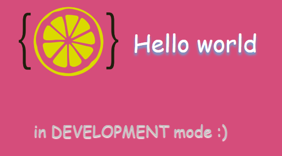
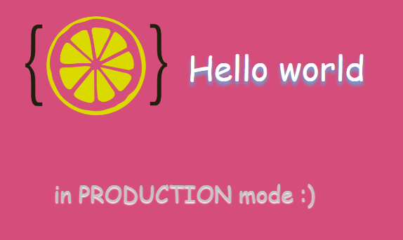
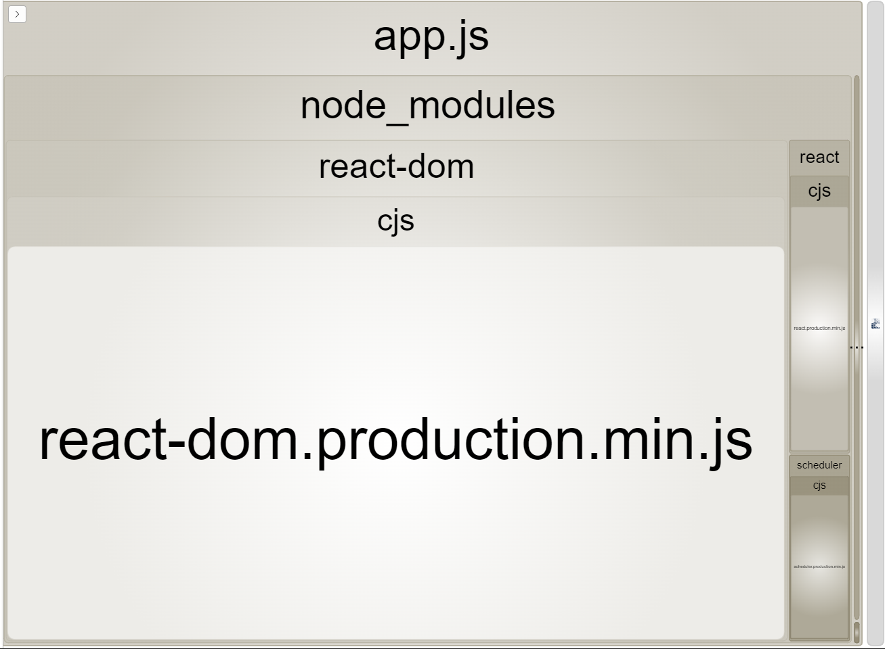

# Master Frontend XII Lemoncode 🍋

## Module 3 Bundling Parcel v2

 

[Go back - Index](https://github.com/MiguelJiRo/Master-Frontend-XII-Lemoncode)

[Go - Module 3 - Optional Parcel v2](https://github.com/MiguelJiRo/Master-Frontend-XII-Lemoncode-Module-3-Bundling-Parcel-v2)

 

 

### Básico
<ol>
    <li>Tenga el bundling montado con webpack ✅</li>
    <li>Muestre un logo ✅</li>
    <li>Esté montada con Typescript ✅</li>
    <li>Muestre el texto "hola mundo" estilado con SASS ✅</li>
</ol>

### Opcional
<ol>
    <li>Mostrar un hola mundo desarrollado con React ✅</li>
    <li>Tener una versión de build de producción ✅</li>
    <li>Tener variables de entorno para diferentes entornos (desarrollo y producción) ✅</li>
    <li>Tener una forma de medir cuanto ocupa cada librería y nuestro código en el bundle ✅</li>
    <li>Montar lo mismo con parcel (v2) ✅ </li>
</ol>

[Go - Module 3 - Optional Parcel v2](https://github.com/MiguelJiRo/Master-Frontend-XII-Lemoncode-Module-3-Bundling-Parcel-v2)

 

### Algunas capturas de la práctica

npm run start:dev

npm run start:prod

npm run build:perf

